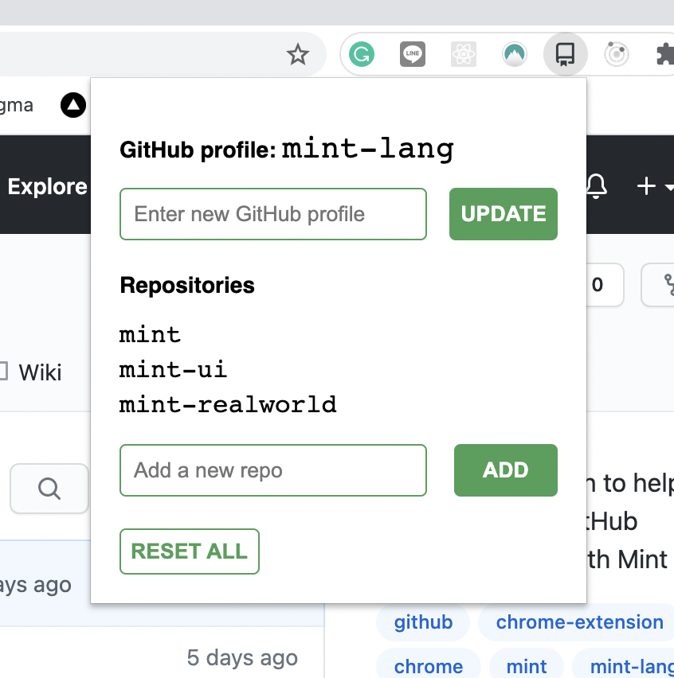
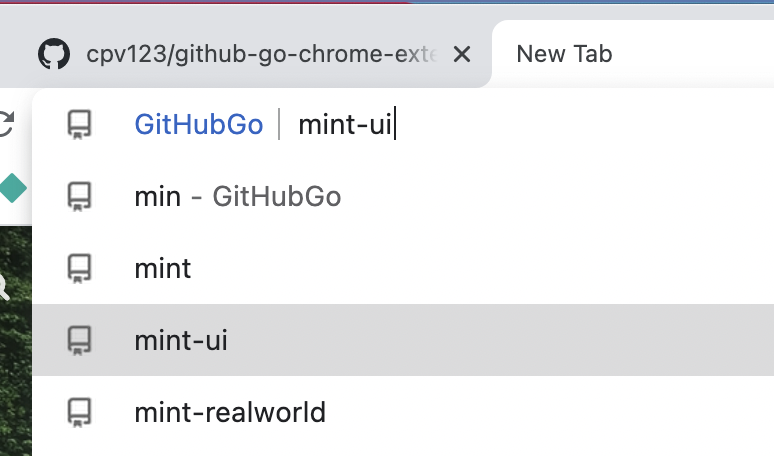

# github-go-chrome-extension

https://chrome.google.com/webstore/detail/github-go/paojlcepodlafkpoecligghmbhjcmdhk

Omnibox extension to help you go straight to a GitHub repository.

1. Save a target GitHub account - this could be a personal profile or organisation
2. Save a list of known repositories for this target account; you can update this list at any time

Activate the extension by typing "gh" followed by a space; you can then either

- Filter through your list of saved repositories and go
- Input the exact name of a repository and go
- Hit space again to see the full list of saved repositories
- Hit enter to go to the target GitHub account itself

## How it's built

`javascript/` --> initially built with vanilla JavaScript, HTML, CSS

`mint/` --> later rebuilt with [Mint](https://www.mint-lang.com/) just to try out something new

## What it looks like

Keeping the CSS simple...

<table>
  <tr>
    <td width=320></td>
    <td width=320></td>
  </tr>
</table>
